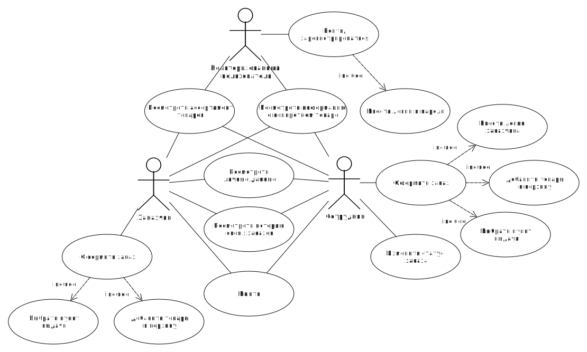
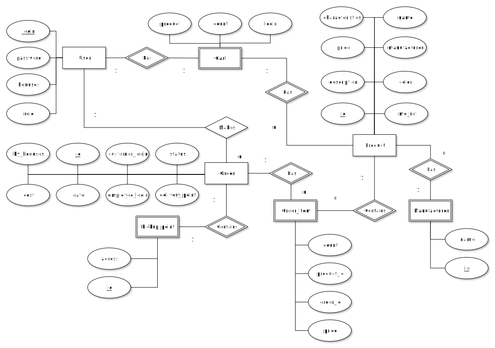
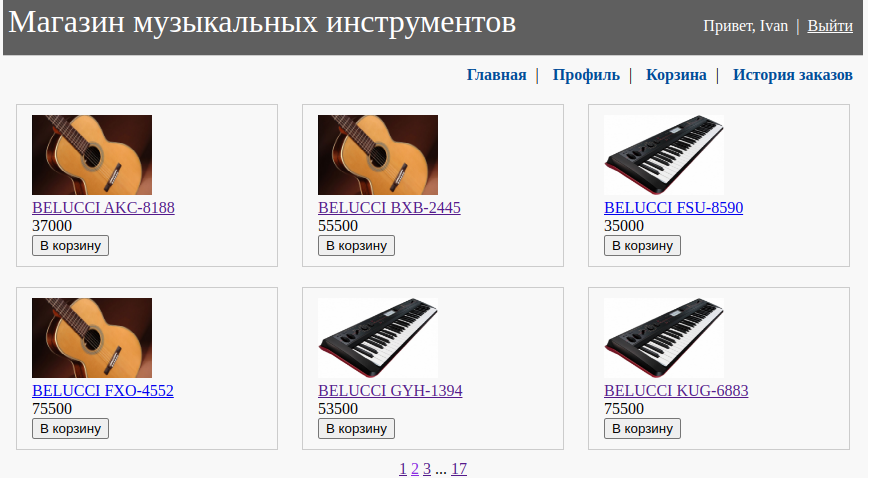
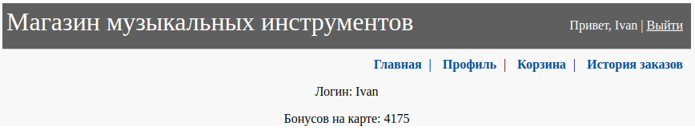
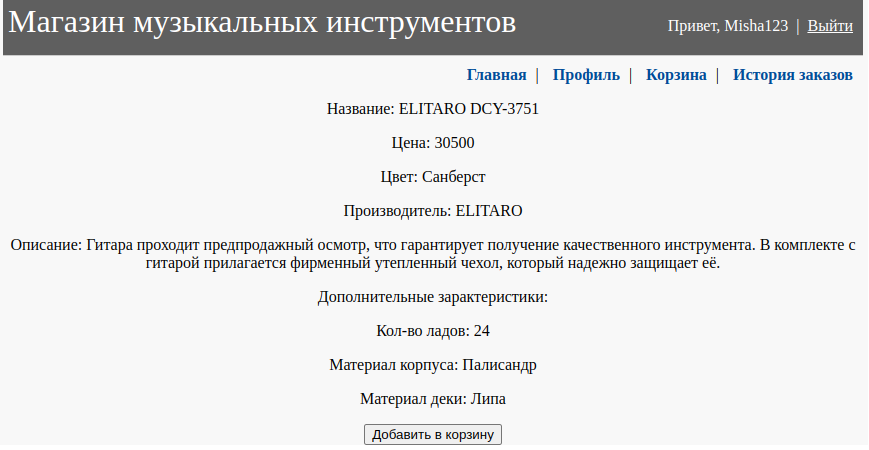
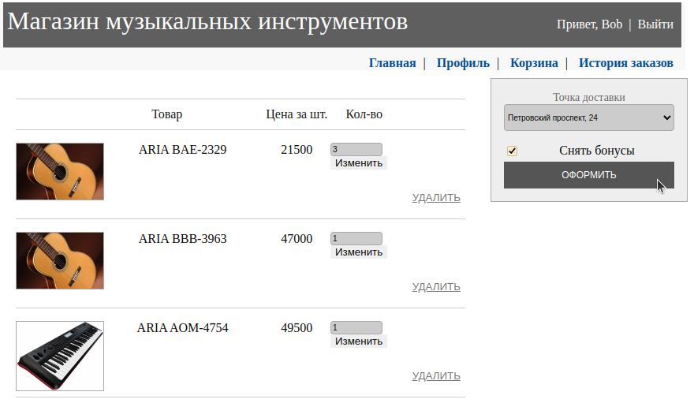
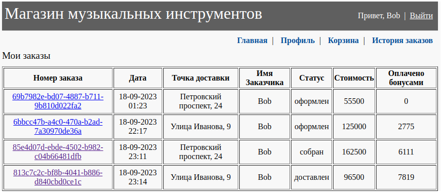
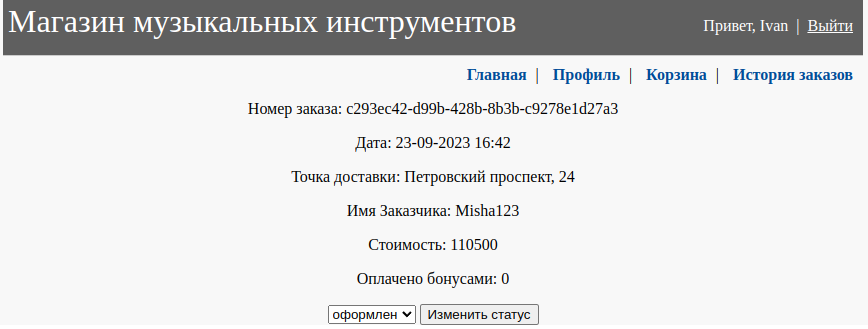

# Магазин музыкальных инструментов
## Содержание
- [Технологический стек](#frameworks)
- [Use-Case диаграмма](#use)
- [ER диаграмма](#er)
- [Как запустить тесты](#tests)
- [Как запустить приложение локально](#run)
- [Деплой MPA версии приложения](#deploy_mpa)
- [Деплой REST API](#deploy_rest)
- [Дизайн MPA версии приложения](#mpa)

<a name="frameworks"></a>
## Технологический стек
- Java
- Gradle
- Spring Framework (Boot, MVC, Security, Data)
- Thymeleaf
- PostgreSQL
- Liquibase
- JUnit
- Test Containers
- CI/CD
   
<a name="use"></a>
## Use-Case диаграмма


<a name="er"></a>
## ER диаграмма


<a name="tests"></a>
## Как запустить тесты
Запуск тестов сервисов.
```
./gradlew :core:test
```

Запуск тестов контроллеров.
```
./gradlew :rest:test
```
<a name="run"></a>
## Как запустить приложение локально
Устанавливаем переменные в .env файле и поднимаем контейнеры с БД и сервером (rest или mpa).
```
cd server
docker compose up -d rest
cd ..
```

Генерируем тестовые данные для БД и копируем их в контейнер.
```
cd db-data
python3 gen.py
./copy_files.sh
```

Внутри контейнера выполняем скрипт для вставки данных.
```
psql -U dev_user -d music_shop_db -f /dump/dump.sql
exit
```

<a name="deploy_mpa"></a>
## Деплой MPA версии приложения
http://213.226.126.69:8085/v1/products.

<a name="deploy_rest"></a>
## Деплой REST API
Swagger:
http://213.226.126.69:8086/v2/swagger-ui

Open-api:
http://213.226.126.69:8086/v2/api-docs

<a name="mpa"></a>
## Дизайн MPA версии приложения
### Домашняя страница


### Информация о пользователе


### Информация о товаре


### Корзина


### История заказов


### Информация о заказе

